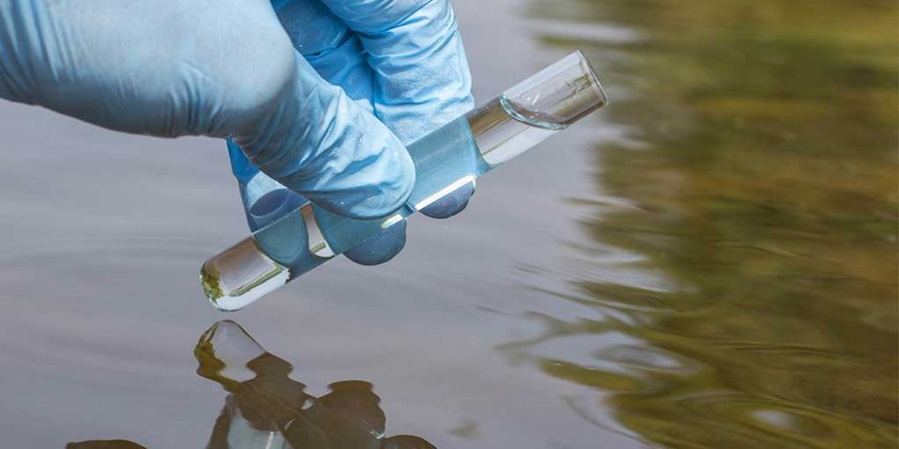

# 💧 AI-Powered Water Quality Prediction System

An end-to-end **Machine Learning web application** that predicts whether water is **safe or unsafe for drinking** based on chemical and biological parameters.
The system transforms complex scientific data into a simple, actionable decision using AI.

---

## 🎯 Project Objective

The goal of this project is to develop an intelligent and accessible tool for assessing **water potability**.
By analyzing key water quality indicators, the system helps identify potentially unsafe water sources that may appear harmless.

---

## 🧠 Machine Learning Model

The core of the application is a trained **Machine Learning Classifier** (`Water_Quality_Prediction_System.pkl`) that predicts water safety.

### Parameters Used for Prediction

* Aluminium
* Ammonia
* Fluoride
* Chromium
* Copper
* Bacteria

The model learns relationships between these parameters and classifies water as **Safe** or **Unsafe**.

---

## 🖥️ Web Application

The trained model is deployed using **Streamlit**, providing an interactive and user-friendly interface.

Users can:

* Input water quality parameters
* Submit values in real-time
* Receive instant prediction
* View classification results

---

## 🚀 Features

* AI-based water potability prediction
* Real-time inference using trained model
* Interactive Streamlit UI
* Clean and simple dashboard
* End-to-end ML pipeline
* Research notebook included

---

## 🛠️ Tech Stack

* Python
* Scikit-learn
* Pandas
* NumPy
* Streamlit
* Matplotlib / Seaborn (EDA)
* Jupyter Notebook

---

## 📂 Project Structure

```id="g3o9w2"
.
├── main.py
├── Water_Quality_Prediction_System.pkl
├── Water_Quality_Prediction_with_Python.ipynb
├── water-testing.jpg
└── README.md
```

---

## ▶️ How to Run Locally

### 1. Clone the repository

```bash id="i82a4e"
git clone https://github.com/Shubham-css/AI-Powered-Water-Quality-Prediction-System.git
```

### 2. Navigate to project folder

```bash id="a6d6b2"
cd AI-Powered-Water-Quality-Prediction-System
```

### 3. Install dependencies

```bash id="v5qg84"
pip install -r requirements.txt
```

### 4. Run the Streamlit app

```bash id="a8l7q1"
streamlit run main.py
```

---

## 📸 Application Preview



---

## 🔬 Research & Development

The complete research process is documented in:

`Water_Quality_Prediction_with_Python.ipynb`

This includes:

* Data Cleaning
* Exploratory Data Analysis (EDA)
* Feature Selection
* Model Training
* Model Evaluation
* Model Export

---

## 🧠 Key Highlights

* End-to-end ML lifecycle implementation
* Real-world water quality dataset
* Deployed interactive prediction app
* Clean Streamlit UI
* Model persistence using pickle
* Research + deployment in one project

---

## 🎯 Use Cases

* Environmental monitoring
* Water safety assessment
* Smart city applications
* Rural water quality evaluation
* Research and education

---

## 🔗 Website Link

https://water-quality-prediction-system-ml-mini-project.streamlit.app/

---

## 👨‍💻 Author

**Shubham**

---

## ⭐ Support

If you found this project useful, consider giving it a ⭐ on GitHub!
